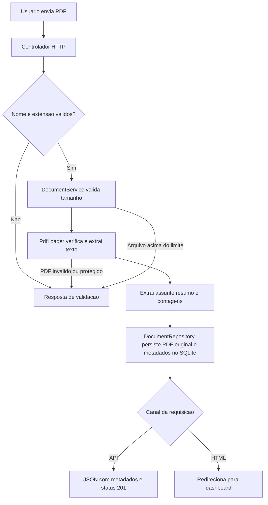

# Aplicação de Critérios de Clean Code na Ingestão de PDFs

## Descrição do Problema

O sistema AI Course Content Builder tem como objetivo apoiar professores na criação de materiais didáticos a partir de documentos de referência. O incremento atualmente implementado é mais restrito: permite enviar PDFs, extrair texto e metadados básicos, armazenar os dados localmente e consultar os documentos por meio de um dashboard e de uma API.

Este relato considera somente esse comportamento existente. Geração de conteúdo por IA, embeddings, RAG, OCR e processamento de outros formatos permanecem fora do incremento atual.

## Entradas

- Um arquivo PDF enviado como `multipart/form-data`, no campo `file`.
- Configuração do limite máximo de tamanho, com padrão de 20 MiB.

## Saídas

- Metadados do documento, incluindo nome, assunto, resumo heurístico, quantidade de páginas, palavras e caracteres, tamanho e hash SHA-256.
- Texto extraído e arquivo PDF original persistidos no SQLite local.
- Resposta JSON na API ou redirecionamento para o dashboard no fluxo HTML.

## Regras de Negócio

- O arquivo deve ter nome e extensão `.pdf`.
- O tamanho não pode exceder o limite configurado.
- Arquivos vazios, ilegíveis ou protegidos por senha são rejeitados.
- O assunto é obtido da primeira linha não vazia; o resumo é formado pelas primeiras linhas e limitado a 360 caracteres. Esses valores são heurísticas, não uma interpretação semântica ou um resumo gerado por IA.
- Uploads válidos são armazenados com o PDF original e o texto extraído.
- A API retorna os registros recentes, limitados a 50 por padrão, e permite consultar um documento pelo identificador.

## Exemplos

### Cenário normal

Um PDF textual válido é enviado para `POST /api/documents`. O sistema extrai o texto, calcula as contagens e retorna `201` com os metadados do documento.

### Cenário limite

Um PDF cujo tamanho seja igual ao limite configurado pode ser processado. O limite é excedido somente quando o tamanho é maior que o valor permitido.

### Cenários de erro

- Um arquivo `anotacoes.txt` é rejeitado com `400`.
- Um PDF inválido ou vazio é rejeitado com `400`.
- Um PDF acima do limite é rejeitado com `413`.
- Um PDF protegido por senha é rejeitado com mensagem de validação.

## Critérios de Clean Code

Para avaliar a implementação, foram considerados estes critérios:

- Usar nomes que expressem a responsabilidade, como `DocumentService`, `PdfLoader` e `DocumentRepository`.
- Manter responsabilidades distintas entre requisição HTTP, regras de ingestão, extração do PDF e persistência.
- Validar entradas nos limites apropriados e comunicar erros com mensagens objetivas.
- Encadear exceções com a causa original quando um erro técnico é convertido em erro de domínio.
- Evitar SQL concatenado; utilizar parâmetros nas consultas.
- Não expor o PDF original e o texto extraído nas respostas de metadados da API.
- Cobrir regras e cenários de falha com testes unitários e de integração.
- Tratar as escolhas de Flask e SQLite como provisórias e não incluir credenciais no código.

## Solução Implementada

O fluxo principal é coordenado por `DocumentService.ingest`. O serviço valida nome, extensão e tamanho; delega leitura ao `PdfLoader`; transforma erros de leitura em erros de ingestão; e encaminha os dados extraídos ao repositório para persistência.

```python
if not filename or not filename.lower().endswith(".pdf"):
    raise UnsupportedFileTypeError("Envie um arquivo com extensão .pdf.")
if len(pdf_bytes) > self.max_pdf_size_bytes:
    raise FileTooLargeError("O PDF excede o limite configurado de tamanho.")

extraction = self.pdf_loader.load(pdf_bytes)
return self.repository.add(
    filename=filename,
    extraction=extraction,
    file_size_bytes=len(pdf_bytes),
    sha256=hashlib.sha256(pdf_bytes).hexdigest(),
    original_pdf=pdf_bytes,
)
```

O controlador adapta o resultado ao canal usado: JSON para rotas `/api/` e redirecionamento para o dashboard no envio HTML.



## Revisão Crítica da Implementação

### Pontos positivos

- O controlador, o serviço, o carregador e o repositório têm papéis distinguíveis.
- Os erros de domínio diferenciam tipo não suportado, tamanho excedido e falha de ingestão.
- O carregador devolve uma estrutura imutável (`PdfExtraction`) com os dados da extração.
- Consultas SQL usam parâmetros, e a conexão é gerenciada por context manager.
- A configuração do caminho do banco e do limite de tamanho pode ser substituída nos testes.

### Pontos de atenção

- O campo `summary` pode sugerir um resumo semântico, embora seja apenas uma composição das primeiras linhas. Convém explicitar essa semântica na interface e na documentação da API; uma futura mudança de nome deve considerar compatibilidade com clientes existentes.
- PDF original e texto extraído são armazenados sem criptografia, retenção ou exclusão implementadas. Não se deve usar documentos sensíveis até que esses controles sejam definidos.
- O MVP não implementa autenticação, autorização, proteção CSRF ou rate limiting. Seu uso deve permanecer em ambiente local ou confiável.
- O processamento lê o upload em memória e o parser não executa OCR para PDFs digitalizados.
- Flask e SQLite são escolhas provisórias ainda dependentes de aprovação arquitetural para evolução além do desenvolvimento local.

Esses limites também estão registrados no [relatório de revisão da ingestão](revisao_ingestao_pdf.md). Não foram tratados aqui como correções já realizadas.

## Verificações Realizadas

Os testes unitários de `PdfLoader` e os testes de integração do upload verificam:

- Extração de texto, assunto, resumo e contagens.
- PDF vazio, malformado ou protegido por senha.
- Upload válido, persistência do PDF original e do texto extraído.
- Rejeição de extensão não suportada e arquivo acima do limite.
- Resposta do dashboard após envio HTML.

Na execução desta documentação, os testes focados foram executados com o interpretador da `.venv`: **10 testes passaram**. Os testes de integração usam um leitor controlado para o fluxo HTTP; há também um teste unitário com PDF real gerado em memória.

## Reflexão Sobre Clean Code

Neste incremento, a separação de responsabilidades é mais visível na divisão entre controlador, serviço, carregador e repositório do que em uma única função extensa. Essa organização facilita testar a extração sem depender da aplicação Web e testar o upload sem acoplar a regra de ingestão ao protocolo HTTP.

O ponto de revisão mais importante é comunicar com precisão o que os dados representam. Um resumo baseado nas primeiras linhas é útil como prévia, mas não deve ser confundido com resumo didático ou conteúdo produzido por IA. A mesma precisão vale para o escopo geral: embeddings, RAG e geração ainda são objetivos futuros, não capacidades deste MVP.

Para uma equipe de QA, a principal contribuição dos critérios explícitos é transformar qualidades abstratas como “código limpo” em responsabilidades e comportamentos verificáveis: cada camada tem uma função, cada regra relevante possui um cenário de teste e cada limitação conhecida é descrita sem prometer comportamento inexistente.